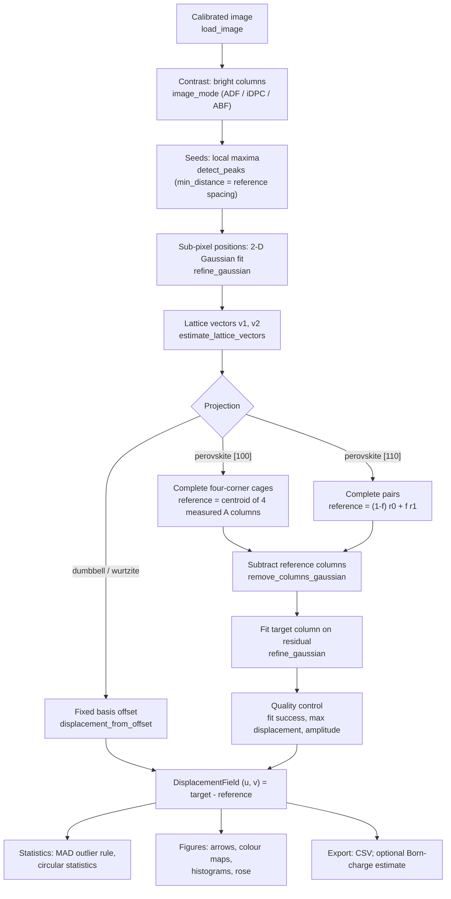
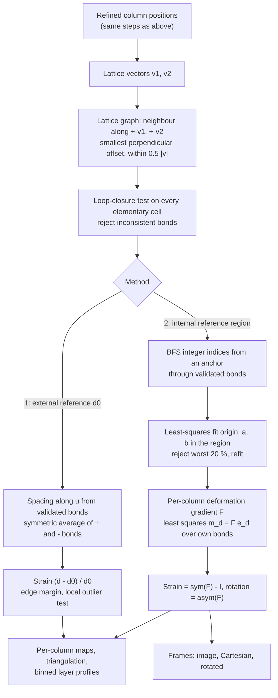

# Algorithm overview

The two workflows share the image handling and column localisation, then
branch into displacement and strain analysis. Function names are given in each
box; every step is documented in the user guide.

## Displacement workflow

## Strain workflow

## Why these choices?

| Step | Choice | Failure mode it avoids |
|---|---|---|
| Displacement reference | centroid of the *measured* complete cage or pair | a global lattice extrapolated over the image drifts away from the local lattice; incomplete cells produce false references |
| Target fit | on the image with reference columns subtracted | tails of bright columns pull the fit of the weak column |
| Neighbour matching | smallest perpendicular offset, limited to half a spacing | picking a column of the adjacent row under shear, or a diagonal column when the neighbour is missing |
| Bond validation | loop closure on each cell | a wrong bond silently propagating into the indexing or the strain |
| Indexing | breadth-first search through validated bonds | "phase slips" when rounding distances from a distant origin |
| Strain (Method 2) | per-column deformation gradient | linear drift of rigid-lattice displacements; noise amplification by differentiating interpolated fields |
| Outliers | median/MAD rules, local for maps | percentile clipping always removes data; global rules delete minority layers |
